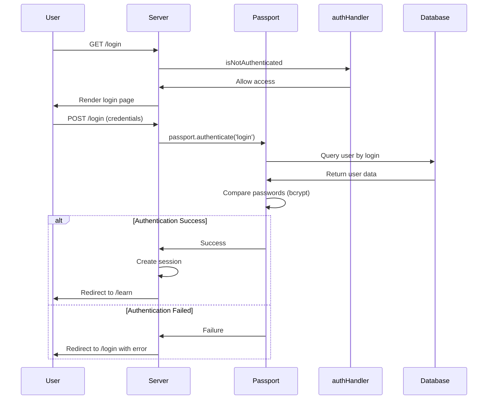
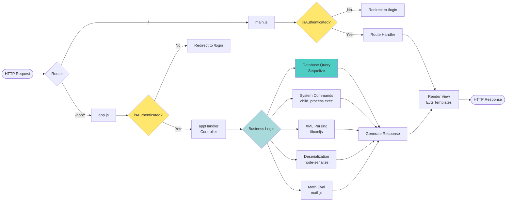
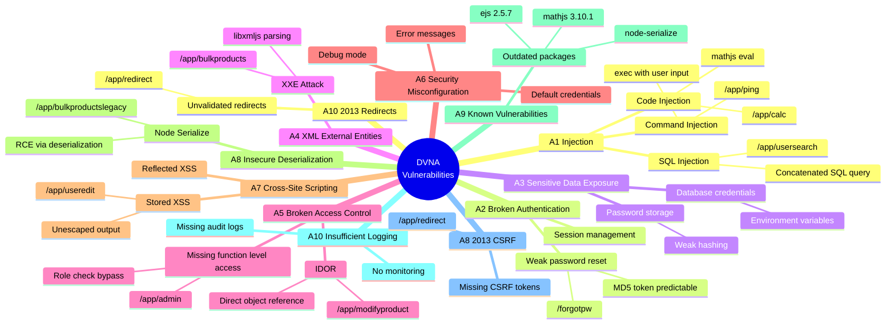
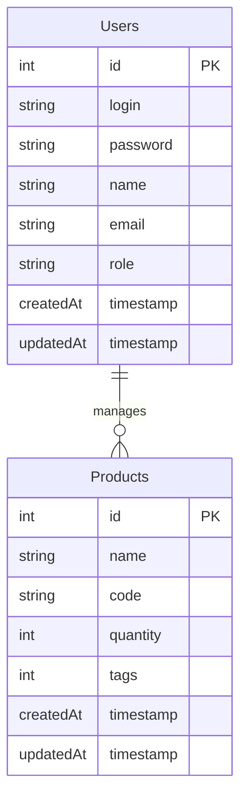
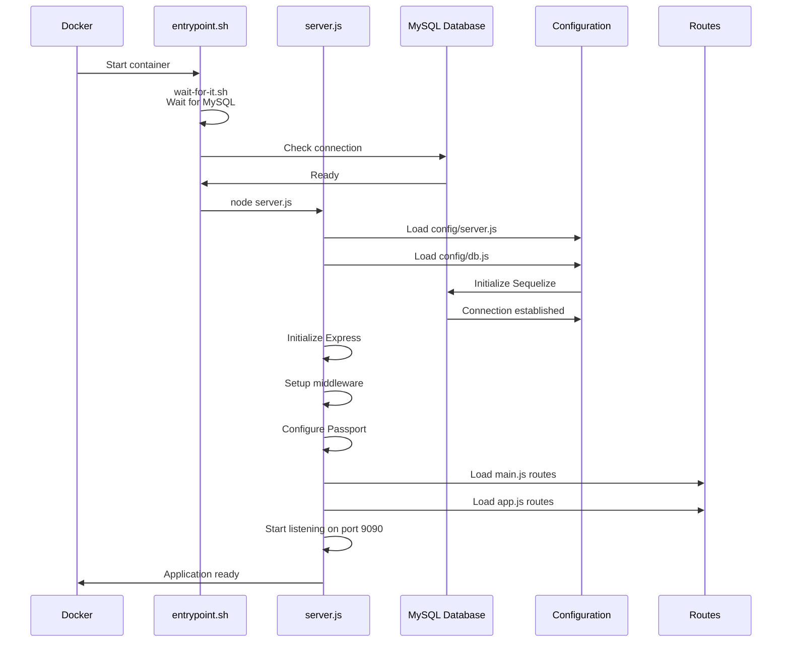
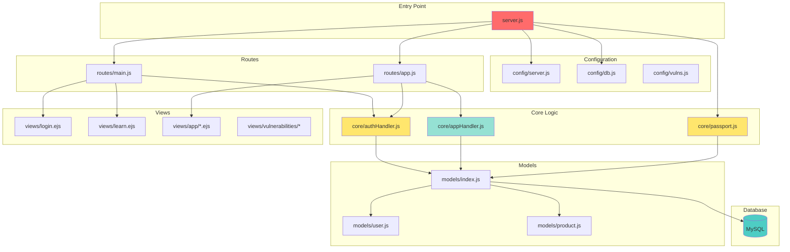

# DVNA Application Flow Diagram

## High-Level Architecture

```mermaid
flowchart TB
    Start([User Access]) --> Server[server.js<br/>Express Server Entry Point]
    
    Server --> Init{Initialize<br/>Application}
    
    Init --> MW[Middleware Setup]
    MW --> Static[Static Files<br/>/public]
    MW --> Session[Express Session]
    MW --> Passport[Passport Authentication]
    MW --> BodyParser[Body Parser]
    MW --> FileUpload[File Upload]
    MW --> Morgan[Morgan Logger]
    
    Init --> Routes{Route<br/>Configuration}
    
    Routes --> MainRoutes[Main Routes<br/>routes/main.js]
    Routes --> AppRoutes[App Routes<br/>routes/app.js]
    
    MainRoutes --> Auth{Authentication<br/>Required?}
    AppRoutes --> AuthCheck[authHandler.isAuthenticated]
    
    Auth -->|No| PublicPages[Public Pages]
    Auth -->|Yes| ProtectedPages[Protected Pages]
    
    PublicPages --> Login[/login<br/>Login Page]
    PublicPages --> Register[/register<br/>Registration Page]
    PublicPages --> ForgotPW[/forgotpw<br/>Forgot Password]
    
    ProtectedPages --> Learn[/learn<br/>Vulnerability List]
    ProtectedPages --> VulnPage[/learn/vulnerability/:vuln<br/>Vulnerability Details]
    
    AuthCheck --> AppFeatures{Application<br/>Features}
    
    AppFeatures --> UserSearch[/app/usersearch<br/>SQL Injection Demo]
    AppFeatures --> Ping[/app/ping<br/>Command Injection Demo]
    AppFeatures --> Products[/app/products<br/>Product Management]
    AppFeatures --> BulkProducts[/app/bulkproducts<br/>Deserialization Demo]
    AppFeatures --> Calc[/app/calc<br/>Code Injection Demo]
    AppFeatures --> Admin[/app/admin<br/>Admin Panel]
    AppFeatures --> UserEdit[/app/useredit<br/>XSS Demo]
    AppFeatures --> ModifyProduct[/app/modifyproduct<br/>Access Control Demo]
    
    Login --> PassportAuth[Passport Local Strategy]
    Register --> PassportAuth
    
    PassportAuth --> DB[(MySQL Database)]
    UserSearch --> DB
    Products --> DB
    UserEdit --> DB
    ModifyProduct --> DB
    Admin --> DB
    
    DB --> Models[Sequelize Models]
    Models --> UserModel[User Model]
    Models --> ProductModel[Product Model]
    
    style Server fill:#ff6b6b
    style DB fill:#4ecdc4
    style Auth fill:#ffe66d
    style AuthCheck fill:#ffe66d
    style AppFeatures fill:#a8dadc
```

## Authentication Flow



## Application Request Flow



## OWASP Top 10 Vulnerability Demonstrations



## Database Schema



## Application Startup Sequence



## Key Components Overview



---

## Summary

**DVNA** is a deliberately vulnerable Node.js application that demonstrates OWASP Top 10 vulnerabilities:

### Technology Stack
- **Framework**: Express.js
- **Authentication**: Passport.js with local strategy
- **Database**: MySQL with Sequelize ORM
- **Template Engine**: EJS
- **Session Management**: express-session

### Main Components
1. **server.js**: Application entry point, middleware configuration
2. **routes/main.js**: Authentication routes (login, register, password reset, learning portal)
3. **routes/app.js**: Application feature routes (user search, ping, products, admin)
4. **core/authHandler.js**: Authentication middleware and password management
5. **core/appHandler.js**: Vulnerable business logic implementations
6. **core/passport.js**: Passport strategies for login/signup
7. **models/**: Sequelize models for Users and Products

### Security Vulnerabilities Demonstrated
- SQL Injection (raw query concatenation)
- Command Injection (exec with user input)
- XXE (XML External Entity attacks)
- XSS (unescaped output)
- Insecure Deserialization (node-serialize)
- Broken Access Control (IDOR, missing authorization)
- Weak Authentication (predictable password reset tokens)
- Security Misconfiguration (debug mode, error disclosure)
- Using vulnerable components (outdated packages)
- Insufficient logging and monitoring

### User Journey
1. User accesses application → redirected to login
2. Registers/logs in → authenticated via Passport
3. Accesses /learn → views vulnerability list
4. Explores vulnerable features under /app/* routes
5. Each feature demonstrates specific OWASP Top 10 vulnerability
